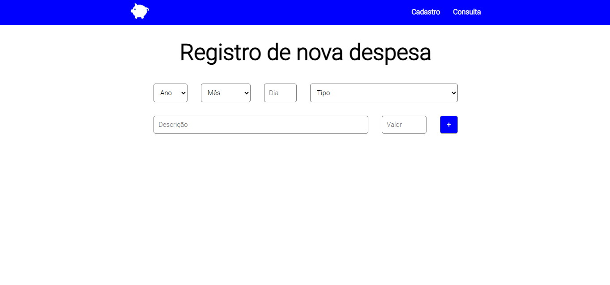
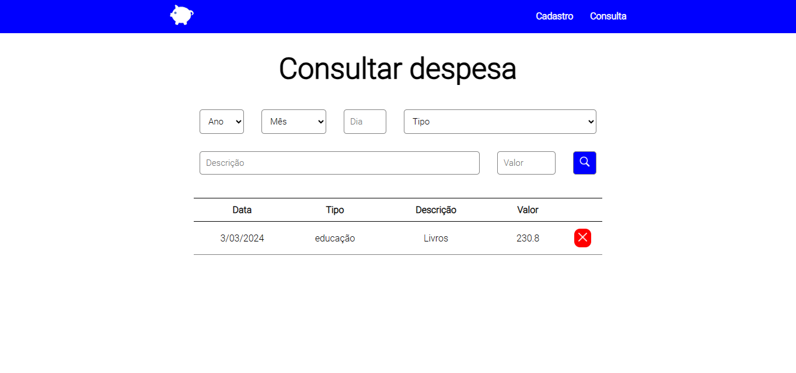

# App Orçamento

Pequeno serviço web desenvolvido em HTML, CSS e JS capaz de armazenar despesas por data, tipo, descrição e valor.

Desenvolvido para fins didáticos empregando o uso de `localStorage` como banco de dados primitivo. Manipulação de conceitos de **POO** em JavaScripit.
>**Registro, consulta e exclusão de despesas**.

